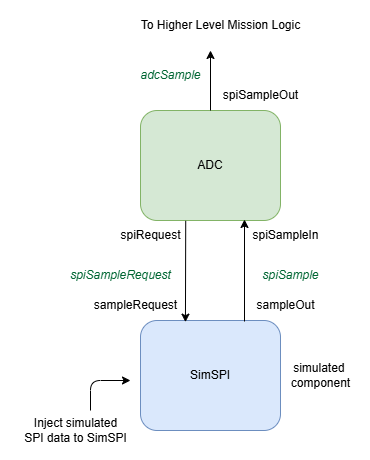

# StarterPack F' project

This project was auto-generated by the F' utility tool. 

F´ (F Prime) is a component-driven framework that enables rapid development and deployment of spaceflight and other embedded software applications.
**Please Visit the F´ Website:** https://fprime.jpl.nasa.gov.

This project includes custom components developed for testing pipleine of reading data from ADC interfaced with the MCU via SPI in a baremetal F´ system. It features an ADC component that sends sample requests to a SimSPI component that simulates SPI responses without hardware. Together, they enable hardware-agnostic testing of ADC sampling and telemetry generation. The setup is compatible with the F´ Ground Data System (GDS) and is designed to ease future porting to the TMS570 microcontroller.